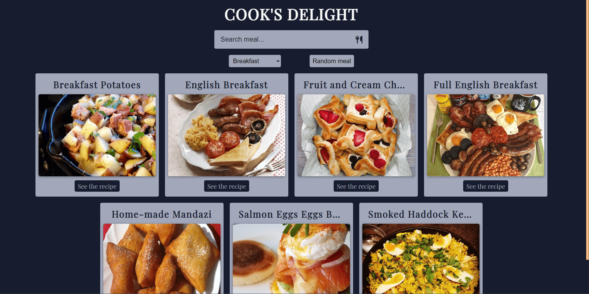
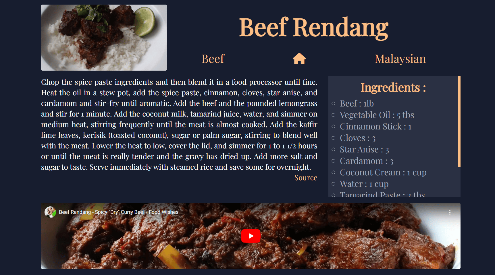

# Cooking Website With API (Meal DB)






### MealDB API :

```terminal
https://www.themealdb.com/api.php
```
## Tester le projet :

```terminal
git clone https://github.com/Cyril-Develop/Cooking-Website-With-API.git